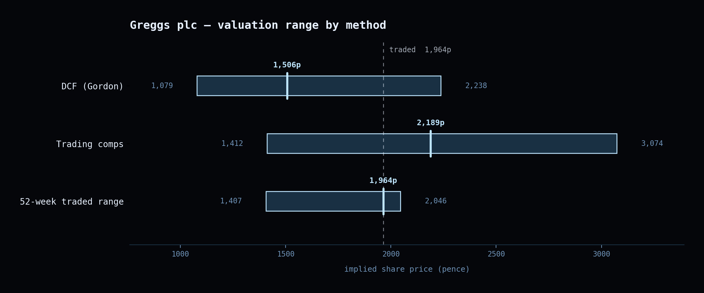

# Bluebook

A three-statement operating model and DCF valuation of **Greggs plc**, generated
from Python and shipped as a live Excel workbook. Every forecast cell in the
delivered file is a formula, the scenario switch is a real toggle, and the
numbers are machine-verified rather than asserted.

**The verification is the point of the project.** The generated workbook is
recalculated through headless LibreOffice and compared cell by cell against the
Python model that produced it — 730 cells per scenario, across five forecast
years and three scenarios. 720 of them are held to **1e-9** (the worst
difference observed is 5.0e-12); the other 10 are the peer table's own tie
rows, which are held to £0.01 because each peer market capitalisation is a
figure transcribed rounded to £0.001m and cannot tie any closer. A separate
scan parses all 863 formulas into a 2,495-edge reference graph and proves it
acyclic. A coverage audit asserts that no computed cell on a calculation sheet
sits outside that comparison without a documented reason, and the eight
integrity checks on the workbook's second tab are themselves asserted — in
every scenario, along with the fact that they are capable of reading FALSE.
305 tests.



*Drawn from the shipped workbook's own recalculated values — see
`scripts/render_football_field.py`. Three bars, not four: the exit-multiple
terminal value is arithmetically the peer median EV/EBIT times terminal EBIT,
so a fourth bar would present one peer statistic twice. See below.*

| | Bear | Base | Bull |
|---|---|---|---|
| Implied share price | 624.68p | **1,506.50p** | 2,560.65p |
| Enterprise value | £1,044.2m | £1,947.9m | £3,028.2m |
| Terminal value as a share of EV | 95.2% | 94.0% | 93.1% |

WACC 7.7311%. Greggs traded at 1,964.0p on 5 August 2026, so the Base case sits
about 23% below the market. FY2025 net debt including lease liabilities £404.0m.

## Running it

```bash
python3 scripts/generate.py          # writes dist/greggs_model.xlsx
python3 scripts/generate.py Bull     # same file, switch starts on Bull
python3 -m pytest                    # 305 tests
```

The workbook in `dist/` is committed, so it can be opened without running
anything. All three scenarios' driver paths are written to the sheet whichever
scenario you generate with — the argument only sets where the switch in
`Assumptions!C3` starts. Changing that one cell re-drives every forecast,
schedule and valuation in the file.

The recalculation tests need LibreOffice on `PATH` (`soffice`). Everything else
runs without it.

## What the model does, and what it assumes

The forecast drivers — revenue growth, margins, capex intensity, working
capital days — are **the author's assumptions, reasoned from the historical
record. They are not company guidance and Greggs has not published a forecast
this was checked against.**

Nor are they the only unsourced inputs. The risk-free rate, equity risk
premium, beta and RCF credit spread are judgement estimates; so are the £50m
minimum cash floor and the LBO's 4.0× entry leverage and 20% IRR hurdle, which
are conventions rather than facts. Every share price, share count and the
52-week range is a one-day observation from a price provider rather than a
filing. Everything else is transcribed from a filing or derived from those
transcriptions. The same list is on the workbook's Cover sheet.

### Historicals are sourced line by line

Every historical figure carries a page citation to the annual report it was read
from, visible in column L of the `Historicals` sheet and attached to the value
itself in `src/bluebook/inputs/greggs.py`. The rule was that a number goes in
only if it can be pointed at in a filing. One figure resisted and is flagged as
such: `GREGGS_FY2025_LEASE_INTEREST`, because the reported finance-costs line
bundles lease interest with other charges.

### Leases: post-IFRS 16 throughout

EBITDA excludes rent, right-of-use depreciation sits inside D&A, and lease
liabilities are inside net debt in the equity bridge. The same treatment is
applied to the DCF, the trading comps and the LBO, so the three are on one
basis and can be read beside each other.

This is also why the financing disclosure quotes the leverage measure it does —
see below. Mixing a post-IFRS 16 EBITDA with a lease-free debt figure is the
easiest way to make a geared forecast look conservative, and the workbook
deliberately does not do it.

### No circular references, and that was a decision

Interest on borrowings is charged on **opening** debt balances, so the workbook
resolves in a single pass with no iteration required.

The conventional alternative — interest on the average of opening and closing
balances — is circular, and the spike that tested it is recorded in
`docs/superpowers/spike-circularity.md`. What it found is the reason for the
decision: **headless LibreOffice does not report a chained or branched
circularity, it silently returns a self-consistent wrong answer.** It resolves
only the first link of a chain and freezes the second branch of a branch. A
model verified through that toolchain on an average-interest basis would have
been verified against a number the tool had quietly made up.

Iterative calculation is still enabled in the delivered file (100 iterations,
0.0001 delta), so that a later edit which does introduce a circularity converges
rather than erroring. The acyclicity test in `tests/test_conventions.py` is what
stops that safety net from hiding a regression.

### The RCF upsize

Forecast borrowings peak in FY2028 at roughly £190–211m depending on scenario,
against the £100m facility Greggs actually drew on at FY2025. **The model
assumes that facility is upsized.** That is an assumption about facility
availability, and the evidence it is a reasonable one is that leverage stays
modest: lease-inclusive net debt peaks at **1.51× EBITDA in the Base case,
1.78× in Bear and 1.30× in Bull**.

Gross borrowings over the same EBITDA would read 0.40–0.56×, which is the more
flattering number and the wrong one — it leaves the lease obligations out of the
numerator while the post-IFRS 16 denominator has already been credited for
them. Both figures are written to the `Checks` sheet, the honest one as the
check and the flattering one as a labelled memo beneath it, so the gap is
visible rather than resolved in favour of the better-looking measure.

### Peer figures are held to a lower standard than Greggs' own

This asymmetry is disclosed on the workbook's Cover sheet and repeated here
because it is the weakest evidence in the project.

Greggs' own figures were read line by line from annual report PDFs and
reconciled to the filings, with page references. **The peer figures were not.**
They came from RNS announcements via a summarising fetcher, and while they were
cross-checked internally — the peer table's own tie rows are asserted by the
test suite — they were not read from source documents and carry no page
references. Three of the five peer EBITDAs are build-ups from printed
components rather than printed subtotals.

The load-bearing statistic is the peer median EV/EBIT of 13.4277×, and that one
rests entirely on printed EBIT figures. But the two sets of numbers sit in one
table and are not of equal quality, and the workbook says so rather than
presenting them as equivalents.

### Known simplifications

Things the model does not do, listed because an interviewer will find them and
it is better to have said them first. None changes the shape of the answer;
the largest is worth about 16p on a 1,506p Base case.

- **The share count is weighted-average diluted**, an EPS construct, where
  period-end diluted is the more standard divisor for an implied share price.
  Worth roughly 16p per 1% of share count. It is the filing's figure and the
  workbook carries the price provider's alternative beside it on `Comps`,
  0.51% away.
- **No finance income is modelled on the cash balance** — roughly £2m a year
  pre-tax, £1.5m after. There is no driver for it, and adding one would mean
  forecasting a rate on a balance the revolver already pins to its floor.
- **The right-of-use mirror of the excess-PP&E tax shield is not applied**,
  worth about 3p a share. The PP&E side is; the lease side was judged not
  worth the extra terminal machinery.
- **`ppe_depreciation_rate` includes impairment** and is also used as the
  perpetual asset decay rate, so the perpetuity assumes the estate is impaired
  at FY2025's rate forever. Conservative, and it lowers the valuation.
- **The terminal EBITDA margin is left at the FY2030 driver** rather than
  normalised to a through-cycle level.

### The exit multiple is not a second opinion

The `DCF` sheet carries a terminal value on the Gordon growth method and one on
an exit multiple. They are not two methods. Because
`EV/EBITDA ≡ EV/EBIT × (1 − D&A/EBITDA)` is an identity and the exit multiple is
derived from the peer median EV/EBIT, the exit-multiple terminal value is
arithmetically the peer median times terminal EBIT in every scenario. It
contains no information the comps do not already carry, the sheet states this
beside the number, and the football-field chart deliberately has **no
exit-multiple bar** — three bars, not four, because a fourth would present one
peer statistic twice and read as corroboration.

## The workbook

Thirteen sheets. `Cover` carries the disclosures, `Checks` is second so it
cannot be missed, and every check on it is a live formula returning TRUE or
FALSE — all eight read TRUE in all three scenarios in the delivered file.

| Sheet | |
|---|---|
| `Cover` | Disclosures: leases, circularity, the RCF assumption, peer provenance, the impairment convention, and what is not sourced |
| `Checks` | Eight live integrity tests, plus the figures behind the financing note |
| `Assumptions` | Drivers, all three scenario paths, and the switch in `C3` |
| `Historicals` | FY2023–FY2025 as reported, with a page citation per line |
| `IS` `BS` `CF` | The three statements, FY2026–FY2030 |
| `Schedules` | Working capital, fixed assets, leases, equity, debt |
| `DCF` | WACC, the re-based terminal year, and the equity bridge |
| `Sensitivity` | 5×5 implied price and terminal multiple grids |
| `Comps` | Five peers, the statistics, and Greggs on the peers' basis |
| `LBO` | A sponsor case at the traded EV |
| `Football Field` | Three bars: DCF range, comps range, 52-week traded range |

Blue cells are typed inputs, black are calculated on the sheet, green are links
from another sheet. Only five sheets may hold a hardcoded number at all; a test
enforces it against the finished file, and the writer refuses it at the point
of writing.

The 52-week traded range and the peer share prices are market observations from
5 August 2026. They are the only figures here that are wrong tomorrow rather
than wrong on the merits, and the sheets that carry them say so.

## Layout

```
src/bluebook/
  inputs/          reported figures, each with its source
  schedules/       working capital, fixed assets, leases, debt
  reference.py     the three statements
  valuation.py     WACC, terminal year, DCF, equity bridge
  comps.py         peer set and trading multiples
  lbo.py           sponsor case
  workbook/        the sheet writers, one per sheet
tests/             305 tests
scripts/generate.py
dist/greggs_model.xlsx
```

The model modules are closed: `reference.py`, `valuation.py`, `comps.py`,
`lbo.py`, `assumptions.py`, `inputs/` and `schedules/` have been through twelve
rounds of independent review, two full independent recomputations of the
valuation, and 52 injected mutations with no escapes. Changes belong in
`workbook/` and `tests/`.

Row positions are never hardcoded in the writers. A two-pass build learns where
each row landed and refuses to save if the two passes disagree, so every
cross-sheet reference is resolved through the layout rather than written by
hand.
